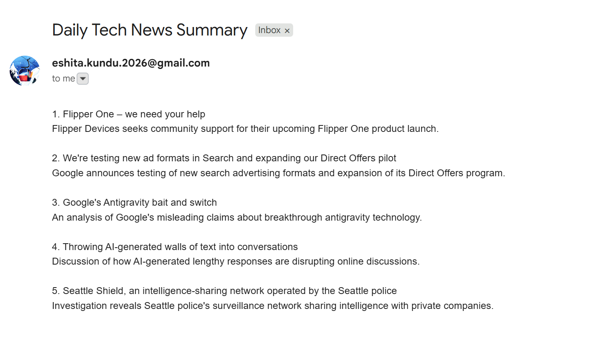

# daily-tech-digest

An AI-powered workflow built on [Heym](https://heym.run) that fetches the top stories from Hacker News every morning, summarises them using an LLM, and delivers a clean digest to your inbox.

## Workflow

**Pipeline:** `Cron → HTTP Request → LLM → Send Email`

| Node | What it does |
|---|---|
| Cron | Triggers daily at 8am |
| httpRequest | Fetches top 10 HN front page stories via Algolia API |
| llm | Summarises top 5 stories into one-liner descriptions |
| sendEmail | Delivers the digest to your inbox via Gmail SMTP |

## Output

## Setup

### Prerequisites
- [Heym](https://heym.run) (self-hosted via Docker)
- OpenRouter account (free tier works)
- Gmail account with SMTP app password

### Credentials to configure in Heym

**OpenRouter (Custom OpenAI-Compatible)**
- Base URL: `https://openrouter.ai/api/v1`
- API Key: your OpenRouter key

**Gmail SMTP**
- SMTP Server: `smtp.gmail.com`
- Port: `587`
- Username: your Gmail address
- Password: Gmail app password (generate at myaccount.google.com/security)

### Import
1. Download `workflow.json`
2. Open Heym → New Workflow
3. Use the **Download** button to import the JSON
4. Attach your credentials to the `llm` and `sendEmail` nodes
5. Update the `to` field in `sendEmail` with your email
6. Run or wait for the 8am cron trigger

## Stack
- **Platform:** Heym v0.0.30
- **Data source:** [HN Algolia API](https://hn.algolia.com/api) (free, no auth)
- **LLM:** OpenRouter free tier
- **Email:** Gmail SMTP
